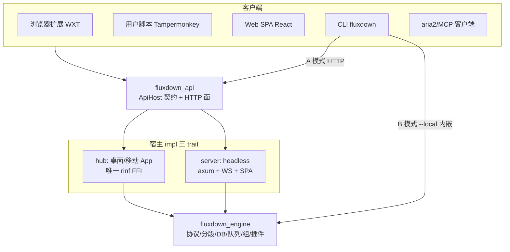
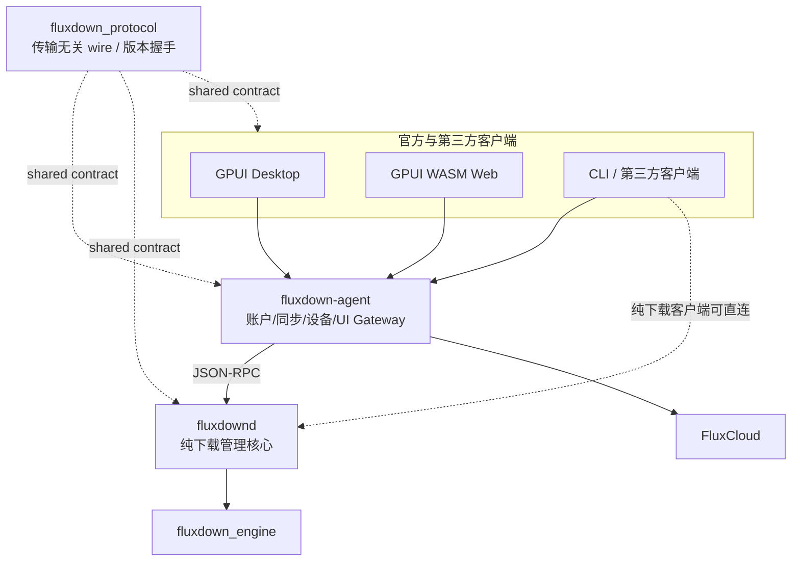

# FluxDown internals · 索引 · 架构图 · 目录树

> 本文件是 `FluxDown/AGENTS.md` 的深挖附录：只放**枚举性 / 可从源码复原**的细节，硬不变式与红线在 AGENTS.md。
> 路径以 `FluxDown/` 为根（cwd=工作区根时前置 `FluxDown/`）。事实层以源码为准，文档给坐标。

---

## 产品定位

> **"Downloads, Supercharged."**（下载，全面加速。）

- **核心价值主张**: Rust 驱动的高速多协议下载，永久免费，零广告，零追踪（仅两条匿名部署遥测，可关），本地优先，无需账号即可全功能使用。
- **平台矩阵（已发布）**: Windows / macOS / Linux 桌面 App、Android App、headless Web 服务器（Docker/群晖/QNAP/OpenWrt/Unraid/CasaOS）、CLI（`fluxdown`）、浏览器扩展、用户脚本。iOS 代码存在但无发布 job。
- **可选云能力（FluxCloud）**: 登录账号后跨设备**配置同步**（客户端已落地，见 `clients.md`「Flutter 前端架构」）；下载本身永远本地，账号非必需。

---

## 附录索引

| 文件 | 内容 |
|---|---|
| `README.md`（本文件） | 架构全图、顶层目录树 |
| `engine.md` | 状态与数据模型、DB 表与字段语义、6 协议、引擎子系统、插件系统、受管组件 |
| `hosts-and-api.md` | HTTP API 路由组与鉴权、hub / cli / nmh / updater、headless server env 与路由 |
| `clients.md` | Flutter 前端（主题 / 云同步 / widgets / 移动端 / 设置项分类）、扩展、用户脚本、Web SPA、官网 |
| `ops.md` | 日志系统、发布与 CI、设计文档实现状态 |
| `extension-points.md` | 「要加 X 改哪里」全表 |

---

## 顶层架构

**一个引擎，多个宿主，多个客户端。** 所有下载逻辑集中在 `fluxdown_engine`（`native/engine`，零 FFI/零 rinf 依赖），通过**三个引擎自有 trait** 与外界解耦：

| Trait | 定义位置 | 方向 | 职责 |
|---|---|---|---|
| `EventSink` | `engine/src/events.rs` | 引擎→宿主 | 进度/分段拆分/队列变化/组变化等事件推送 |
| `HostSelection` | `engine/src/selection.rs` | 引擎→宿主（请求决策） | HLS 画质 / BT 文件 / 插件 variant 选择（tristate：用户选/超时默认/无 selector 短路） |
| `ApiHost` | `native/api/src/service.rs` | 客户端→引擎（HTTP 契约） | REST/aria2/MCP 的能力面；必需方法 + 可默认降级方法 |



**要点**：
- `fluxdown_api` 只依赖 `&dyn ApiHost`，不碰引擎——同一套 HTTP 面（脚本接管 + aria2 JSON-RPC（POST 与 WS）+ MCP + `/api/v1` 管理 + OpenAPI）可服务任意宿主。
- 两个生产宿主：`hub`（App，actor=`download_actor.rs`）、`server`（headless，actor=`actor.rs`）。两者的 actor **都必须** drain `resolve_rx`（off-actor 插件解析回流）与 `plugin_retry_rx`，否则命中 resolver 的下载会永久挂起。
- 客户端捕获有三条并行前端进同一本机 RPC（`:17800/download`）：扩展（webRequest+downloads 全拦截）、用户脚本（页面态 `GM_xmlhttpRequest` 回退）、桌面确认框。
- **并发模型**: current_thread tokio actor 串行化写；每个下载 spawn 独立 task + CancellationToken；插件 resolve 永不阻塞 actor（off-actor spawn + 通道回流）。

### 下一代本机服务边界（基础 crate 已落盘，运行链路迁移中）



- `native/daemon` 是 aria2c 式纯下载核心目标：下载任务、下载设置、RSS、插件和下载事件归它；账户与云同步永不进入该边界。
- `native/agent` 是可选但常驻的官方客户端后端：独占 FluxCloud Token、配置同步、设备协同和远程任务状态机；官方 UI 默认只连接 agent。
- `native/protocol` 是 daemon、agent、GPUI/WASM/CLI 共享的 wire 层；目前已落地服务角色与版本握手，JSON-RPC 方法/事件随实际迁移补充，禁止提前建立第二套 DTO。
- 当前生产路径仍是 `hub` / `server`；迁移完成前不得把目标图误报为已运行。`native/server` 只保留旧 headless 路径，不接收新架构功能。

---

## 仓库结构（顶层坐标）

```
FluxDown/
├── lib/src/            Flutter 前端（桌面+移动，共享 models/i18n/theme/bindings）
│   ├── bindings/       ⚠️ rinf 自动生成，勿手改
│   ├── models/         状态与领域模型（ChangeNotifier + rinf 信号）
│   ├── pages/          home_page / settings_page
│   ├── widgets/        桌面 UI 组件族（见 `clients.md`「Flutter 前端架构」）
│   ├── mobile/         移动端 UI（Android 已发布；简化：无窗口/托盘/NMH）
│   ├── popup/          第二 Flutter 引擎（快速下载独立小窗，--quick-popup）
│   ├── services/       服务层（含 cloud/ 云同步子系统、win32_toast/）
│   ├── theme/          双层 token 系统（颜色 + 度量，schema v2）
│   └── i18n/           翻译（Weblate 管理，assets/i18n/*.json 为源）
├── crates/             GPUI PC 客户端迁移层（同一 Rust workspace，见 `clients.md`「GPUI PC 客户端」）
│   ├── i18n/           构建期发现并嵌入 Flutter `assets/i18n/*.json`
│   ├── theme/          完整 gpui-base semantic token + shadcn neutral + 运行时投影
│   ├── components/     基于 gpui-base 行为原语的主题化应用组件
│   ├── shell/          窗口、顶层导航、locale/theme 状态
│   └── app/            `fluxdown-desktop` 薄二进制入口
├── native/             Rust workspace 引擎/宿主层（根 members=`native/*` + `crates/*`）
│   ├── engine/         `fluxdown_engine`：下载引擎（零 FFI）——核心，见 `engine.md`「下载引擎」
│   ├── api/            `fluxdown_api`：ApiHost 契约 + HTTP 面（零 rinf）——见 `hosts-and-api.md`「HTTP API」
│   ├── protocol/       `fluxdown_protocol`：daemon / agent / 客户端共享的传输无关协议基线
│   ├── daemon/         `fluxdown_daemon`：纯下载常驻核心边界（运行链路迁移中）
│   ├── agent/          `fluxdown_agent`：云功能与官方 UI Gateway 边界（运行链路迁移中）
│   ├── server/         `fluxdown_server`：headless Web 服务器——见 `hosts-and-api.md`「Headless 服务器」
│   ├── hub/            rinf FFI 适配层（唯一碰 rinf）——见 `hosts-and-api.md`「宿主与客户端 crate」
│   ├── cli/            `fluxdown_cli`：二进制 `fluxdown`——见 `hosts-and-api.md`「宿主与客户端 crate」
│   ├── nmh/            Native Messaging Host 中继二进制
│   └── fluxdown_updater/  独立自更新 helper 二进制（hub 拉起）
├── web/                Web SPA（React 19 + TanStack + Tailwind v4，bun）——见 `clients.md`「Web SPA」
├── website/            官网（Astro SSR + 内容集文档系统）——见 `clients.md`「官网」
├── fluxDown/           WXT 浏览器扩展（Chrome/Firefox MV3）——见 `clients.md`「浏览器扩展与用户脚本」
├── userscript/         Tampermonkey 用户脚本（扩展替代）——见 `clients.md`「浏览器扩展与用户脚本」
├── examples/plugins/   插件示例（.fxplug 源）
├── packaging/          NAS 包脚本（synology/qnap/openwrt）——见 `hosts-and-api.md`「Headless 服务器」
├── promotion/          分发模板（unraid/casaos/awesome-selfhosted/mcp）
├── docker/             server.Dockerfile + docker-compose.yml
├── installer/windows/  Inno Setup
├── bucket/             Scoop manifest
├── docs/               设计文档（实现状态见 `ops.md`「设计文档实现状态」）
├── android/ ios/ macos/ linux/ windows/   各平台原生工程
└── .github/workflows/release.yml   组件变更检测发布流水线——见 `ops.md`「发布与 CI」
```
