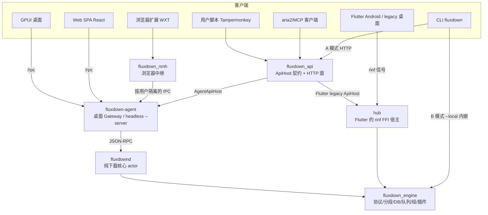
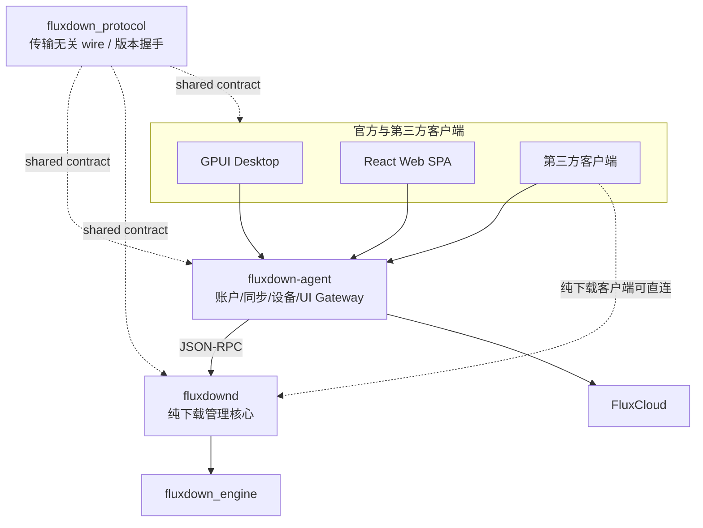

# FluxDown internals · 索引 · 架构图 · 目录树

> 本文件是 `FluxDown/AGENTS.md` 的深挖附录：只放**枚举性 / 可从源码复原**的细节，硬不变式与红线在 AGENTS.md。
> 路径以 `FluxDown/` 为根（cwd=工作区根时前置 `FluxDown/`）。事实层以源码为准，文档给坐标。

---

## 产品定位

> **"Downloads, Supercharged."**（下载，全面加速。）

- **核心价值主张**: Rust 驱动的高速多协议下载，永久免费，零广告，零追踪（仅两条匿名部署遥测，可关），本地优先，无需账号即可全功能使用。
- **平台矩阵（已发布）**: Windows / macOS / Linux 桌面 = **GPUI**，Android = **Flutter**；headless Web 服务器 = `fluxdown-agent --server` + `fluxdownd`（Docker/群晖/QNAP/OpenWrt/Unraid/CasaOS）；另有 CLI（`fluxdown`）、浏览器扩展、用户脚本。iOS 代码存在但无发布 job。
- **可选云能力（FluxCloud）**: 登录账号后跨设备**配置同步**（agent 与 Flutter 客户端已落地，GPUI / Web SPA 通过 agent 使用，见 `clients.md`）；下载本身永远本地，账号非必需。
- **版本来源**: Rust 发行物按 release tag 注入 `FLUXDOWN_APP_VERSION`，服务/GPUI 读 `fluxdown_protocol::APP_VERSION`；`pubspec.yaml` 只承担 Flutter 工程版本及部分本地构建回退，不是所有产物的全局版本号来源。详细取值链见 `ops.md`「发布与 CI」。

---

## 附录索引

| 文件 | 内容 |
|---|---|
| `README.md`（本文件） | 架构全图、顶层目录树 |
| `engine.md` | 状态与数据模型、DB 表与字段语义、6 协议、引擎子系统、插件系统、受管组件 |
| `hosts-and-api.md` | HTTP API 路由组与鉴权、hub / cli / nmh / updater、headless server env 与路由 |
| `clients.md` | GPUI 桌面、Flutter 移动端/legacy（主题 / 云同步 / widgets）、扩展、用户脚本、Web SPA、官网 |
| `ops.md` | 日志系统、发布与 CI、设计文档实现状态 |
| `extension-points.md` | 「要加 X 改哪里」全表 |

---

## 顶层架构

**一个引擎，多个宿主，多个客户端。** 所有下载逻辑集中在 `fluxdown_engine`（`native/engine`，零 FFI/零 rinf 依赖），经引擎的 `EventSink` / `HostSelection` 与 API 层的 `ApiHost` 解耦：

| Trait | 定义位置 | 方向 | 职责 |
|---|---|---|---|
| `EventSink` | `engine/src/events.rs` | 引擎→宿主 | 进度/分段拆分/队列变化/组变化等事件推送 |
| `HostSelection` | `engine/src/selection.rs` | 引擎→宿主（请求决策） | HLS 画质 / BT 文件 / 插件 variant 选择（tristate：用户选/超时默认/无 selector 短路） |
| `ApiHost` | `native/api/src/service.rs` | 客户端→引擎（HTTP 契约） | REST/aria2/MCP 的能力面；必需方法 + 可默认降级方法 |


```mermaid
flowchart TB
  subgraph clients[客户端]
    gpui[GPUI 桌面]
    flutter[Flutter Android / legacy 桌面]
    ext[浏览器扩展 WXT]
    us[用户脚本 Tampermonkey]
    web[Web SPA React]
    cli[CLI fluxdown]
    aria[aria2/MCP 客户端]
  end
  api[fluxdown_api<br/>ApiHost 契约 + HTTP 面]
  nmh[fluxdown_nmh<br/>浏览器中继]
  agent[fluxdown-agent<br/>桌面 Gateway / headless --server]
  daemon[fluxdownd<br/>纯下载核心 actor]
  hub[hub<br/>Flutter 的 rinf FFI 宿主]
  eng[fluxdown_engine<br/>协议/分段/DB/队列/组/插件]
  gpui -->|/rpc| agent
  web -->|/rpc| agent
  ext --> nmh
  nmh -->|按用户隔离的 IPC| agent
  us --> api
  aria --> api
  api -->|AgentApiHost| agent
  api -->|Flutter legacy ApiHost| hub
  agent -->|JSON-RPC| daemon
  daemon --> eng
  flutter -->|rinf 信号| hub
  hub --> eng
  cli -->|A 模式 HTTP| api
  cli -->|B 模式 --local 内嵌| eng
```

**要点**：
- `fluxdown_api` 只依赖 `&dyn ApiHost`，不碰引擎——同一套 HTTP 面（脚本接管 + aria2 JSON-RPC（POST 与 WS）+ MCP + `/api/v1` 管理 + OpenAPI）可服务任意宿主。
- 生产链路：GPUI 桌面与 headless 共用 agent + daemon（`AgentApiHost` 将 HTTP 操作转发给 daemon；daemon 的 `actor.rs` 独占引擎）；Flutter Android / legacy 桌面仍由 `hub` 的 `download_actor.rs` 持有引擎。持有引擎的 actor **都必须** drain `resolve_rx`（off-actor 插件解析回流）与 `plugin_retry_rx`，否则命中 resolver 的下载会永久挂起。`native/server` 已冻结。
- 客户端捕获汇入 agent 的同一捕获/确认队列：扩展经 NMH IPC，用户脚本经 `:17800/download`，桌面经 `/rpc` 提交；不是所有前端都经过 HTTP `/download`。
- **并发模型**: current_thread tokio actor 串行化写；每个下载 spawn 独立 task + CancellationToken；插件 resolve 永不阻塞 actor（off-actor spawn + 通道回流）。

### 桌面与 headless 本机服务边界（已用于发行链路）


```mermaid
flowchart TB
  subgraph ui[官方与第三方客户端]
    gpui[GPUI Desktop]
    web[React Web SPA]
    third[第三方客户端]
  end
  agent[fluxdown-agent<br/>账户/同步/设备/UI Gateway]
  daemon[fluxdownd<br/>纯下载管理核心]
  protocol[fluxdown_protocol<br/>传输无关 wire / 版本握手]
  cloud[FluxCloud]
  engine[fluxdown_engine]
  gpui --> agent
  web --> agent
  third --> agent
  third -. 纯下载客户端可直连 .-> daemon
  agent -->|JSON-RPC| daemon
  agent --> cloud
  daemon --> engine
  protocol -. shared contract .-> agent
  protocol -. shared contract .-> daemon
  protocol -. shared contract .-> ui
```

- `native/daemon` 是 aria2c 式纯下载核心：下载任务、下载设置、RSS、插件和下载事件归它；账户与云同步永不进入该边界。
- `native/agent` 是可选但常驻的官方客户端后端：独占 FluxCloud Token、配置同步、设备协同和远程任务状态机；官方 UI 默认只连接 agent。
- `native/protocol` 是 daemon、agent 与 GPUI / React Web SPA 等客户端共享的 wire 层，服务角色、握手、JSON-RPC 方法/事件与 DTO 都以实际协议目录为准，不为 UI 建立第二套 DTO。
- `native/link`（`fluxdown_link`）是局域网直连（L1）协议本体：身份、配对（SAS）、mDNS 发现、直连传输、地址解析（`http(s)://host[:port][/base]`），持久化经 `LinkStorage` trait 注入——agent 用自身状态文件，引擎的 `link::DbLinkStorage` 只服务 Flutter hub / 冻结的 `native/server`。不依赖引擎、数据库或 UI。
- 当前发行路径：Windows / macOS / Linux = GPUI 桌面 → agent + daemon，headless / NAS 同用 agent + daemon；Android = Flutter → `hub`（iOS 无发布 job）。`lib/` 的桌面 UI 只保留 legacy / wire 兼容，不再发布 PC 包。`native/server` 已冻结（不构建/不发布/不改），已由新链路取代。

---

## 仓库结构（顶层坐标）

```
FluxDown/
├── lib/src/            Flutter Android + 保留的 legacy 桌面（共享 models/i18n/theme/bindings）
│   ├── bindings/       ⚠️ rinf 自动生成，勿手改
│   ├── models/         状态与领域模型（ChangeNotifier + rinf 信号）
│   ├── pages/          home_page / settings_page
│   ├── widgets/        桌面 UI 组件族（见 `clients.md`「Flutter 前端架构」）
│   ├── mobile/         移动端 UI（Android 已发布；简化：无窗口/托盘/NMH）
│   ├── popup/          第二 Flutter 引擎（快速下载独立小窗，--quick-popup）
│   ├── services/       服务层（含 cloud/ 云同步子系统、win32_toast/）
│   ├── theme/          双层 token 系统（颜色 + 度量，schema v2）
│   └── i18n/           翻译（Weblate 管理，assets/i18n/*.json 为源）
├── crates/             已发布 GPUI PC 客户端（同一 Rust workspace，见 `clients.md`「GPUI PC 客户端」）
│   ├── i18n/           构建期发现并嵌入 Flutter `assets/i18n/*.json`
│   ├── theme/          完整 gpui-base semantic token + shadcn neutral + 运行时投影
│   ├── components/     基于 gpui-base 行为原语的主题化应用组件
│   ├── shell/          窗口、顶层导航、locale/theme 状态
│   └── app/            `fluxdown-desktop` 薄二进制入口
├── native/             Rust workspace 引擎/宿主层（根 members=`native/*` + `crates/*`）
│   ├── engine/         `fluxdown_engine`：下载引擎（零 FFI）——核心，见 `engine.md`「下载引擎」
│   ├── api/            `fluxdown_api`：ApiHost 契约 + HTTP 面（零 rinf）——见 `hosts-and-api.md`「HTTP API」
│   ├── protocol/       `fluxdown_protocol`：daemon / agent / 客户端共享的传输无关协议基线
│   ├── daemon/         `fluxdown_daemon`：桌面/headless 的纯下载常驻核心
│   ├── agent/          `fluxdown_agent`：桌面/headless 的云功能与官方 UI Gateway
│   ├── link/           `fluxdown_link`：局域网直连 L1 协议（配对 / mDNS / 直连传输），agent 与 hub 共用
│   ├── server/         `fluxdown_server`：**已冻结**的旧 headless 宿主（不构建/不发布），由 `agent --server` + `daemon` 取代
│   ├── hub/            Flutter 移动端的 rinf FFI 适配层（唯一碰 rinf）——见 `hosts-and-api.md`「宿主与客户端 crate」
│   ├── cli/            `fluxdown_cli`：二进制 `fluxdown`——见 `hosts-and-api.md`「宿主与客户端 crate」
│   └── nmh/            Native Messaging Host 中继二进制
├── web/                Web SPA（React 19 + TanStack + Tailwind v4，bun）——见 `clients.md`「Web SPA」
├── website-v2/         官网主站（Astro SSR + 内容集文档系统，根路径部署）——见 `clients.md`「官网」
├── website/            旧官网存档（挂 `/v1/`，不再更新内容）——见 `clients.md`「官网」
├── fluxDown/           WXT 浏览器扩展（Chrome/Firefox MV3）——见 `clients.md`「浏览器扩展与用户脚本」
├── userscript/         Tampermonkey 用户脚本（扩展替代）——见 `clients.md`「浏览器扩展与用户脚本」
├── examples/plugins/   插件示例（.fxplug 源）
├── packaging/          NAS 包脚本（synology/qnap/openwrt）——见 `hosts-and-api.md`「Headless 服务器」
├── promotion/          分发模板（unraid/casaos/awesome-selfhosted/mcp）
├── docker/             server.Dockerfile + docker-compose.yml
├── installer/windows/  Inno Setup
├── bucket/             Scoop manifest
├── docs/               设计文档（实现状态见 `ops.md`「设计文档实现状态」）
├── android/ ios/   Flutter 移动端原生工程
└── .github/workflows/   ci.yml 主干门禁 + release.yml 组件发布——见 `ops.md`「发布与 CI」
```
